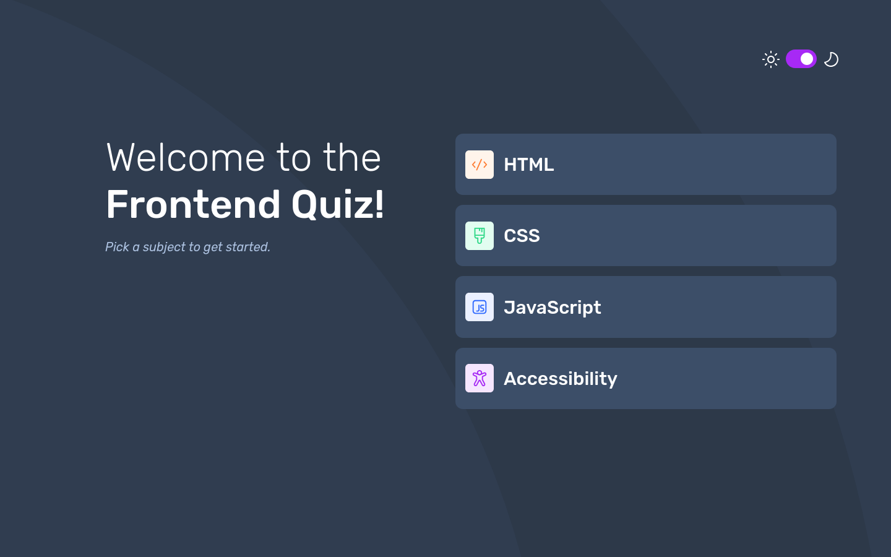

# Overview

This is a solution to the [Frontend quiz app challenge on Frontend Mentor](https://www.frontendmentor.io/challenges/frontend-quiz-app-BE7xkzXQnU).

The website was done using only Vanilla HTML, CSS, Javascript.

## Screenshot

## Link to Website (hosted with GitHub Pages)

- [Frontend Mentor Solution URL](https://www.frontendmentor.io/challenges/frontend-quiz-app-BE7xkzXQnU)
- [Live Site URL - GitHub Pages](https://cristian-nastase.github.io/Frontend-quiz-app/)

## Author
- GitHub: https://github.com/Cristian-Nastase
- Frontend Mentor: https://www.frontendmentor.io/profile/Cristian-Nastase
